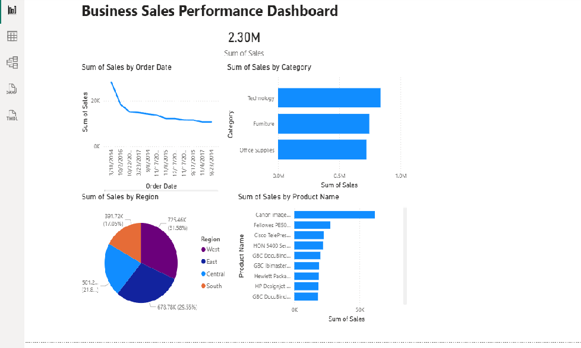

# Business Sales Performance Analytics

## 📊 Project Overview
Analysis of Superstore sales data to identify revenue trends, top-selling products, high-value categories, and regional performance patterns.

**Internship:** Data Science & Analytics - Future Interns  
**Task:** Task 1  
**Duration:** January 2026

---

## 🎯 Objective
Analyze business sales data to answer critical questions:
- Which products generate the most revenue?
- How do sales change over time?
- Which categories or regions are most profitable?
- Where should the business focus to grow?

---

## 🛠️ Tools & Technologies
- **Microsoft Excel** - Data exploration and cleaning
- **Power BI Desktop** - Interactive dashboard creation
- **Kaggle** - Dataset source

---

## 📁 Dataset
**Source:** Superstore Sales Dataset (Kaggle)
- **Records:** 9,994 transactions
- **Time Period:** 2014-2017
- **Categories:** Technology, Furniture, Office Supplies
- **Regions:** West, East, Central, South

---

## 🔍 Key Insights

### 1️⃣ Technology Category Leads Revenue
Technology generates **$836K (36%)** of total sales, followed by Furniture at $742K and Office Supplies at $719K.

### 2️⃣ West Region Dominates
West region contributes **31-32% ($725K)** of total sales, making it the strongest performing market.

### 3️⃣ Sales Trends Show Patterns
Analysis reveals quarterly fluctuations indicating seasonal patterns useful for inventory planning.

### 4️⃣ Top Products Identified
- **#1:** Canon imageCLASS
- **#2:** Fellowes PB500
- **#3:** Cisco TelePresence

### 5️⃣ Total Revenue
**$2.30 Million** in total sales across all categories and regions.

---

## 💡 Business Recommendations

✅ **Prioritize Technology:** Allocate 40-45% of inventory budget to tech products  
✅ **Expand West Strategy:** Replicate success in underperforming regions  
✅ **Stock Top Products:** Maintain strong inventory for Canon, Fellowes, Cisco  
✅ **Seasonal Planning:** Optimize inventory for peak sales periods  
✅ **Monitor KPIs:** Set up monthly performance tracking dashboards

---

## 📊 Dashboard Preview



The interactive Power BI dashboard includes:
- Total Sales KPI Card
- Sales Trend Over Time (Line Chart)
- Sales by Category (Bar Chart)
- Sales by Region (Pie Chart)
- Top 10 Products (Bar Chart)

---

## 📂 Repository Contents

| File | Description |
|------|-------------|
| `Superstore_Sales_Dashboard.pbix` | Power BI dashboard file |
| `Dashboard_Screenshot.png` | Visual preview of dashboard |
| `Sample - Superstore.csv` | Original dataset |
| `README.md` | Project documentation (this file) |

---

## 🎓 Skills Demonstrated

✅ Data Cleaning & Preparation  
✅ Business Analytics & KPI Analysis  
✅ Data Visualization (Power BI)  
✅ Insight Generation & Business Storytelling  
✅ Strategic Recommendation Development  

---

## 👤 Author

**Sourav**  
Data Science & Analytics Intern  
Future Interns - January 2026

---

## 🙏 Acknowledgments

- **Future Interns** for the internship opportunity
- **Kaggle** for the Superstore dataset
- **Microsoft** for Power BI Desktop

---

**⭐ If you found this project helpful, please give it a star!**
```
